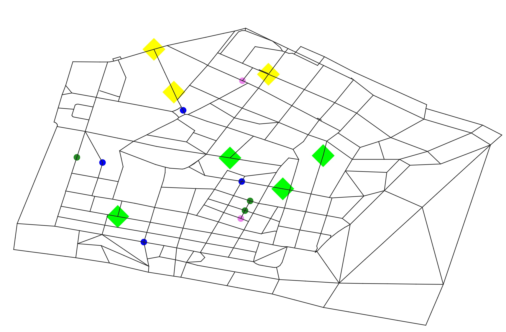
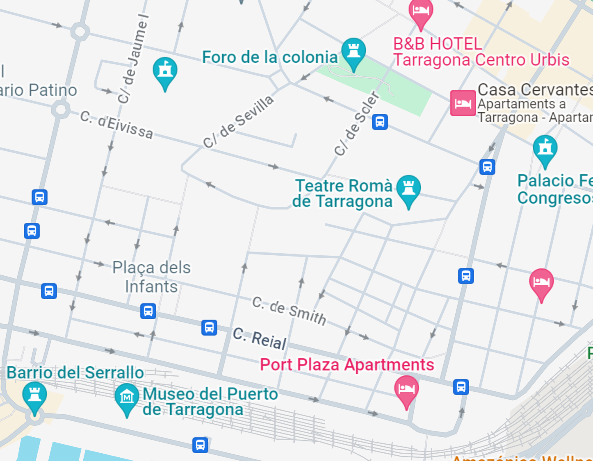

# IMAS Practical Work: Treasure Hunt Simulation


## Authors
- [Becerra, Alberto](https://github.com/BecTome)
- [Bercowsky, Andrés](https://github.com/bercowsky)
- [Campàs, Carla](https://github.com/carlacampas)
- [González-Béjar, Javier](https://github.com/Javier200107)
- [Monfort, Marc](https://github.com/marcmonfort)

## Overview
This project involves creating a multi-agent system (MAS) to simulate a treasure hunt scenario. It utilizes Dedale, a JADE-based agent environment framework. The core objective is to implement basic agent technology concepts and coordinate agents to optimize treasure collection on a generated map.

- [IMAS Practical Work: Treasure Hunt Simulation](#imas-practical-work-treasure-hunt-simulation)
  - [Authors](#authors)
  - [Overview](#overview)
  - [Practice Description](#practice-description)
  - [Setup and Execution](#setup-and-execution)
  - [Specific Implementation](#specific-implementation)
    - [Agent Types](#agent-types)
    - [Treasure Types](#treasure-types)
    - [Map](#map)
  - [Results](#results)


## Practice Description
- **Scenario**: Agents cooperate to explore an unknown map and collect treasures (gold/diamonds).
- **Map**: An undirected graph with nodes (places) and edges (paths).
- **Treasure Types**: Vary in amount and require specific lock-picking and strength levels.
- **Agent Types**: Explorers, Tankers, Collectors, with specific roles and abilities.
- **Goal**: Efficiently grab all treasures with minimal steps and optimal agent coordination.

## Setup and Execution
- Custom map creation using OpenStreetMap data.
- Apache Maven 3.9.5
- openjdk 21.0.1

Run the following commands to clean, install and run the code:
```bash
mvn clean install exec:java
```

**Note**: In `pom.xml`, profiles can be configured to run different scenarios.

## Specific Implementation

### Agent Types
1. **Explorer**: its goal is to explore the environment. It is unable to grab treasures, but has the best strength and lock-picking abilities. It can share their known part of the map with other explorers to gradually construct the map of the whole environment. It can also compute the path from a given node A to a given node B if they are on its map.
2. **Tanker**: its goal is to carry the obtained treasures, both gold and diamonds. Even though
it can carry a nearly unlimited number of treasures, it is unable to collect treasures and
to unlock safes.
3. **Collector**: its goal is to collect the treasures. It has a limited capacity backpack to carry
either gold or diamonds, just one type of treasure. It can grab as many treasures as its
backpack allows. If a Tanker agent is in range, it can drop the treasure of its backpack to
the Tanker. It has limited abilities to open safes.

| Agent type | Backpack Capacity Gold | Backpack Capacity Diamonds | Detection Radius | Lock-picking | Strength |
|------------|------------------------|----------------------------|------------------|--------------|----------|
| Explorer   | -1                     | -1                         | 0                | 2            | 3        |
| Explorer   | -1                     | -1                         | 0                | 3            | 2        |
| Explorer   | -1                     | -1                         | 0                | 3            | 2        |
| Collector  | 50                     | -1                         | 0                | 1            | 1        |
| Collector  | 50                     | -1                         | 0                | 1            | 1        |
| Collector  | -1                     | 50                         | 0                | 1            | 1        |
| Collector  | -1                     | 50                         | 0                | 1            | 1        |
| Tanker     | 400                    | 400                        | 0                | 0            | 0        |
| Tanker     | 400                    | 400                        | 0                | 0            | 0        |

### Treasure Types

| Treasure type | Amount | Lock-picking | Strength |
|---------------|--------|--------------|----------|
| Gold          | 100    | 3            | 3        |
| Gold          | 80     | 2            | 2        |
| Gold          | 60     | 2            | 1        |
| Gold          | 60     | 1            | 2        |
| Gold          | 40     | 1            | 1        |
| Diamonds      | 100    | 3            | 3        |
| Diamonds      | 80     | 2            | 2        |
| Diamonds      | 60     | 2            | 1        |
| Diamonds      | 60     | 1            | 2        |
| Diamonds      | 40     | 1            | 1        |

### Map

A simplified map of 500 nodes from Tarragona train station area was used for this project. The map was generated using OpenStreetMap data.

<!-- Insert double column images -->


The original map has been revised and modified so that the agents couldn't get stuck in dead ends. The map is also undirected, so that the agents can move in both directions on the edges.

## Results

The project implemented an Intelligent Multi-Agent System for a treasure hunt challenge, using agents to gather treasures on a map. It tackled inefficiencies of random movement with a mission-request system, path planning, and buffer mechanisms to avoid revisits. Communication challenges were resolved using specific Jade protocols, while collectors' path conflicts were managed through a back-off strategy. Communication range experimentation revealed a trade-off between coordination and performance, with a need for balanced communication strategies. Though the project was simplified, it highlighted the importance of efficiency and adaptability in multi-agent systems.